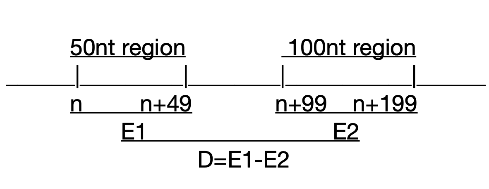

# Ejercicio 1

**1. Completar el código fuente del programa 1.1 para implementar el predictor D(n) de Kanhere y Bansal, justificando los valores de cutoff1 y cutoff2 de acuerdo con las figuras de su artículo. Es necesario comentar el código explicando sus cambios. Pueden usar el lenguaje de programación que quieran.**
```{r}
library(data.table)

# Parámetops ára calcular energía libre
NNparams <- list(c("H" = -7.9, "S" = -22.2), c("H" = -7.2, "S" = -20.4),
                 c("H" = -7.2, "S" = -21.3), c("H" = -8.5, "S" = -22.7),
                 c("H" = -8.4, "S" = -22.4), c("H" = -7.8, "S" = -21.0),
                 c("H" = -8.2, "S" = -22.2), c("H" = -10.6,"S" = -27.2),
                 c("H" = -9.8, "S" = -24.4), c("H" = -8.0, "S" = -19.9),
                 # initiation costs
                 c("H" = 0.1, "S" = -2.8),
                 c("H" = 2.3, "S" = 4.1),
                 # symmetry correction
                 c("H" = 0, "S" = -1.4) )
names(NNparams) = c('AA/TT','AT/TA','TA/AT','CA/GT','GT/CA',
                    'CT/GA','GA/CT','CG/GC','GC/CG','GG/CC','G','A','sym')

# Lista para obtener secuencias complementarias
complement <- list("T" = "A", "A" = "T", "C" = "G", "G" = "C")

# Función para dividir una cadena de 
# caracteres en secuencias de tamaño w
getDNAWindow <- function(text, r, w) {
  substr(text, r, r+(w-1))
}

# Función para obtener la cadena complementaria
# reversa de una secuencia
getRevComplement <- function(text) {
  comp <- lapply(strsplit(text, "")[[1]], function(c){
    return(complement[[c]])
  })
  return(paste(rev(comp), collapse="" ))
}

# Función para obtener los sumandos de la energía libre 
# de una secuencia de acuerdo a sus nucleótidos de inicio y fin
sumExtremos <- function(seq, tK) {
  nseq <- nchar(seq)
  exts <- c(substr(seq, 1, 1), substr(seq, nseq, nseq))
  dG_ext <- sapply(exts, function(nt){
    if(is.null(NNparams[[nt]])) {
      nt <- complement[[nt]]
    }
    return((1000 * NNparams[[nt]]["H"] - tK * NNparams[[nt]]["S"]) /1000)
  })
  return(sum(dG_ext))
}

# Función para obtener el sumando de la energía libre 
# de una secuencia cuando corresponde a una secuencia simétrica
sumSym <- function(seq, tK) {
  nseq <- nchar(seq)
  mid <- trunc(nseq/2)
  a <- substr(seq, 1, mid)
  b <- getRevComplement(substr(seq, nseq-mid + 1, nseq))
  
  if(a == b) {
    return((1000 * NNparams[["sym"]]["H"] - tK * NNparams[["sym"]]["S"]) /1000)
  }
  return(0)
}

# Función para obtener el sumando de la energía libre
# de una secuencia. Será llamada por cada par de nucleótidos.
sumStep <- function(step, tK) {
  if(is.null(NNparams[[step]])) {
    step <- paste(rev(strsplit(step, NULL)[[1]]), collapse="" )
  }
  return((1000 * NNparams[[step]]["H"] - tK * NNparams[[step]]["S"])/1000)
}

# Función para obtener la energía libre en un conjunto de 
# secuencias generadas como ventanas en pasos de 1 nucleótido.
# Recibe como parámetro DNAseqs: lista de secuencias separadas
# por una base y t: temperatura.
duplex_deltaG <- function (DNAseqs, t) {
  total_dG = c()
  tK = 273.15 + t
  DNAseqs <- sapply(DNAseqs, toupper)
  
  # Como las ventanas están separadas por una base, no es necesario
  # calcular todas los sumandos de la fución de energía libre. 
  # Calculamos el valor para la primera secuencia y actualizaremos
  # ese valor para cada ventana. 
  # Para eso restaremos el valor del sumando del primer par de bases
  # de la ventana anterior y sumaremos el valor del último par de
  # bases de la ventana siguiente.
  firstseq <- unlist(strsplit(DNAseqs[[1]], ""))
  nseq <- length(firstseq)
  
  # Sumamos todos los valores de sumandos para la secuencia 1. 
  firstdG <- sapply(1:(nseq-1), function(n) {
    DNAstep <- paste(firstseq[n], firstseq[n+1], "/", 
                     complement[firstseq[n]], complement[firstseq[n+1]], sep="")
    return(sumStep(DNAstep, tK))
  })
  
  total_dG <- append(total_dG, sum(firstdG))
  
  # Para los valores de las siguientes secuencias
  for(i in 2:length(DNAseqs)) {
    # El valor total de los sumandos se la secuencia anterior
    prevVal <- total_dG[(i-1)]
    # El primer par de bases de la secuencia anterior
    prevfirst <- paste(substr(DNAseqs[i-1], 1, 2), "/", 
                       complement[substr(DNAseqs[i-1], 1, 1)], 
                       complement[substr(DNAseqs[i-1], 2, 2)], sep="")
    # El último par de bases de la secuencia actual
    newlast <- paste(substr(DNAseqs[i], nseq-1 , nseq), "/", 
                     complement[substr(DNAseqs[i], nseq-1, nseq-1)], 
                     complement[substr(DNAseqs[i], nseq, nseq)], sep="")
    
    # Obtenemos el valor de los sumandos para la ventana actual
    total_dG <- append(total_dG, prevVal - sumStep(prevfirst, tK) + sumStep(newlast, tK))
  }
  
  # Obtenemos los valores de los sumandos para todas las ventanas
  # de acuerdo a sus pares de bases en los extremos y si es que 
  # son simétricas
  ext_sym <- sapply(DNAseqs, function(dna) {
    sumExtremos(dna, tK) + sumSym(dna, tK)
  })
  
  # Sumamos todos los sumandos en la función.
  total_dG = total_dG + ext_sym
  names(total_dG) <- DNAseqs
  #total_dG contiene el valor de la energía libre para cada una 
  # de las secuencias en DNAseqs
  return(total_dG)  
}

# Función para calcular los valores de E1, E2 y D, para las secuencias
# en el data frame DNA_df, con un tamaño de ventana de winsize
# El proceso se puede paralelizar en el cálculo para cada secuencia.
# El data frame tiene dos variables: sequence y name
calculateNNdG <- function(DNA_df, winsize, temp) {
  all.seq.params <- parallel::mclapply(X = 1:nrow(DNA_df), 
                                       mc.cores = 3, 
                                       FUN = function(i) {
    
    DNAseq <- DNA_df[i, "sequence"]
    name <- DNA_df[i, "name"]
    nDNA <- nchar(DNAseq)
    # De acuerdo al algoritmo, el valor de E2 cada k requiere visitar hasta
    # el nucleótido k + 199
    prom.params <- lapply(1:(nDNA-(199+(winsize-1))), function (k) {
       # Calculamos la energía de k a k+49 en ventanas de tamaño winsize
      
       # Generamos las ventanas de la 50-ésima región
       DNAseqs50 <- sapply(k:(k+49), getDNAWindow, text = DNAseq, w = winsize)
       #Calculamos la energía libre para todas las ventanas
       deltaG1s <- duplex_deltaG(DNAseqs50, temp)
       # E1 es el promedio de los valores de energía libre de la región
       E1 <- mean(deltaG1s)
       
       # Generamos las ventanas de la 100-ésima región
       DNAseqs100 <- sapply((k+100):(k+199), getDNAWindow, text = DNAseq, w = winsize)
       #Calculamos la energía libre para todas las ventanas
       deltaG2s <- duplex_deltaG(DNAseqs100, temp)
       # E1 es el promedio de los valores de energía libre de la región
       E2 <- mean(deltaG2s)
       
       #Calculamos D
       D = E1 - E2
       #Regresamos una lista con los valores para la posición k
       return(list(bp= k, D = E1 - E2, E1 = E1))
     })
    # Unimos todos los valores resultantes en un data table
    prom.params <- rbindlist(prom.params)
    # Asignamos el nombre de la secuencia analizada
    prom.params[, "name" := name]
    return(prom.params)
  })
  # Unimos todos los valores de todas las k en todas las secuencias
  all.seq.params <- rbindlist(all.seq.params)
}

```

**2. Diseñar una figura donde se muestra esquemáticamente D, E1 y E2 para una posición n.**

```{r out.width = "300px", fig.width=4, fig.fullwidth=TRUE, fig.cap = "Esquema utilizado para calcular E1, E2 y E3", fig.height=4, echo=FALSE}

```
\pagebreak

**3. Graficar D(n) para 100 secuencias del fichero K12_400_50_sites.** 
```{r}
library(ggplot2)
```
```{r nndgs, cache=TRUE}
promotores <- fread("K12_400_50_sites", sep = "\\", col.names = c("name", "sequence"), colClasses = c("char", "char", "NULL"))

nndgs <- calculateNNdG(promotores, 15, 37)
```

```{r  fig.fullwidth=TRUE, fig.width=7, fig.height=2, fig.cap="Gráfica de D(n) para el dataset K12"}
ggplot(nndgs, aes(x = bp - 400, y = D, color = name)) + geom_line()  + theme(legend.position="none") + xlab("bp")
```

```{r  fig.fullwidth=TRUE, fig.width=7, fig.height=2, fig.cap="Gráfica de E1(n) para el dataset K12"}
ggplot(nndgs, aes(x = bp - 400, y = E1, color = name)) + geom_line()  +
  theme(legend.position="none") + xlab("bp")
```

\pagebreak

**4. Hacer un histograma con la distribución de posiciones mínimas de D(n) en las 100 secuencias.** 
```{r  messages=FALSE,fig.fullwidth=TRUE, fig.width=7, fig.height=2, fig.cap="Histograma de valores y posición de los valores mínimos de D(n) en cada secuencia"}
library(dplyr)

mindgs <- nndgs %>% group_by(name) %>% summarize(minD = min(D), bp = bp[which.max(D)]) 
ggplot(mindgs, aes(x = minD)) + geom_histogram(bins = 25, fill = "tan1")  +
  theme(legend.position="none") + xlab("min D value") + theme_bw()

ggplot(mindgs, aes(x = bp-400)) + geom_histogram(bins = 25, fill = "tan1")  +
  theme(legend.position="none")  + xlab("bp") + theme_bw()
```

\pagebreak

**Evaluación de valores de cutoff para D y E1.**

Para evaluar la sensitividad y la precisión de diferentes valores de cutoff para D y E1, utilizamos las secuencias enviadas por Cristian, que corresponden a secuencias entre las posiciones -500 y 500 de diversas regiones regulatorias. 

```{r nndgs_fasta, cache=TRUE}
# Para leer archivos fasta
library(seqinr)
promotores_fasta <- read.fasta("promotor_sequences.faa")
promotores_fasta <- promotores_fasta[1:100]
lista.promotores <- lapply(promotores_fasta, paste, collapse = "")
lista.promotores <- lapply(lista.promotores, toupper)
promotores_fasta <- data.table(name = unlist(lapply(strsplit(names(promotores_fasta), split ="\t"), first)), sequence = unlist(lista.promotores))

nndgs_fasta <- calculateNNdG(promotores_fasta, 15, 37)
``` 

```{r  fig.fullwidth=TRUE, fig.width=7, fig.height=2, fig.cap="Gráfica de D(n) para el nuevo dataset"}
ggplot(nndgs_fasta, aes(x = bp - 500, y = D, color = name)) + geom_line()  +
  theme(legend.position="none") + xlab("bp")
```
```{r  fig.fullwidth=TRUE, fig.width=7, fig.height=2, fig.cap="Gráfica de E1(n) para el nuevo dataset"}
ggplot(nndgs_fasta, aes(x = bp - 500, y = E1, color = name)) + geom_line()  +
  theme(legend.position="none") + xlab("bp")
```

\pagebreak

Evaluación de diferentes valores de cutoffs para E1 y D.

```{r all_true_positives, cache=T}
#Probaremos diferentes cutoffs para E1 y D.
E1cutoffs <- seq(-20, -15,  0.25)
Dcutoffs <- seq(0.5, 3.5, 0.25)
#Matrices para almacenar los resultados 
sensit_matrix <- matrix(rep(0, length(E1cutoffs)*length(Dcutoffs)),
                     nrow = length(E1cutoffs), byrow = T)
precis_matrix <- matrix(rep(0, length(E1cutoffs)*length(Dcutoffs)),
                        nrow = length(E1cutoffs), byrow = T)
rownames(sensit_matrix) <- E1cutoffs
colnames(sensit_matrix) <- Dcutoffs
rownames(precis_matrix) <- E1cutoffs
colnames(precis_matrix) <- Dcutoffs
all_true_positives <- data.frame()
for (e in E1cutoffs) {
  for (d in Dcutoffs) {
    # Filtramos los resultados de acuerdo a los valores de cutoffs
    nndgs_fasta <- nndgs_fasta %>% mutate(passc1 = D > d, passc2 = E1 > e)
    pass <- nndgs_fasta %>% filter(passc1 == TRUE, passc2 == TRUE) %>% select(bp, name)
    
    # Si las señales tienen menos de 25 pares de bases entre ellas, 
    # se cuenta como una sola señal
    p <- lapply(unique(pass[,"name"]), function(name){
      signals <- sort(pass[pass$name == name, "bp"])
      truesig <- data.frame("start" = signals[1], "end" = signals[1], "name" = name)
      for(s in signals[-1]) {
        nl <- nrow(truesig)
        if(abs(truesig[nl, "end"] - s) < 25) {
          truesig[nl, "end"] = s
        } else {
          truesig <- rbind(truesig, list("start" = s, "end" = s, "name" = name))
        }
      }
      return(truesig)
    })
    
    p <- rbindlist(p)
    p <- p %>% mutate(start = start- 500, end = end - 500) %>%
      mutate(truepos = (start >= -150 & start <= 50)  | 
               (end >= -150 & end <= 50))
    # Si las señales se encuentran entre el -150 y el 50, se cuentan como
    # verdaderos positivos
    truepositives <- p %>% filter(truepos == TRUE)
    falsepositives <- p %>% filter(truepos == FALSE)
    # Si hay más de una señal, se elige la más cercana al TSS
    truepositives <- truepositives %>% group_by(name) %>% 
      summarise(cTSS = min(abs(start)), start = start[which.min(abs(start))])
    truepositives <- truepositives %>% mutate("ecutoff" = e, "dcutoff" = d)
    all_true_positives <- rbind(all_true_positives, truepositives)
    falsenegatives <- sum(!(promotores$name %in% truepositives$name))
    # Se calcula la sensibilidad y la precisión de acuerdo al artículo
    sensitivity = nrow(truepositives)/( nrow(truepositives) + falsenegatives)
    precision =  nrow(truepositives)/( nrow(truepositives) + nrow(falsepositives))
    precis_matrix[as.character(e), as.character(d)] = precision
    sensit_matrix[as.character(e), as.character(d)] = sensitivity
  }
}
```

```{r fig.margin = TRUE, fig.width=6, fig.height=4, fig.cap="Gráfica de contorno para los valores de sensibilidad", message=FALSE}
library(reshape2)

sensit_melt <- melt(sensit_matrix, id.vars = c("E1", "D"),
                    measure.vars = "sensitivity")
names(sensit_melt) <- c("E1", "D", "sensitivity")
plt <- ggplot() + stat_contour(data = sensit_melt, 
                        aes(x = E1, y = D, z = sensitivity,
                            color = ..level..), 
                        breaks = seq(0, 1, 0.1)) 
plt <- plt + scale_color_continuous(name = "sensitivity") 
plt
```

```{r fig.margin = TRUE, fig.width=6, fig.height=4, fig.cap="Gráfica de contorno para los valores de precisión"}
precis_melt <- melt(precis_matrix, id.vars = c("E1", "D"),
                    measure.vars = "precision")
names(precis_melt) <- c("E1", "D", "precision")

plt <- ggplot() + stat_contour(data = precis_melt, 
                        aes(x = E1, y = D, z = precision,
                            color = ..level..), 
                        breaks = seq(0, 1, 0.1)) 
plt <- plt + scale_color_continuous(name = "precision") 
plt
```

De acuerdo a nuestras gráficas de contorno y a las gráficas de contorno del artículo, decidimos utilizar los cutoffs, $D = 2.75$ y $E1 = -17.75$. Resultando los valores:
```{r results}
all_true_positives %>% filter(ecutoff == -17.75 & dcutoff == 2.75) %>% 
  select(name, start) %>% print(n = Inf)
```

```{r bib, include=FALSE}
# create a bib file for the R packages used in this document
knitr::write_bib(c('base', 'rmarkdown'), file = 'skeleton.bib')
```