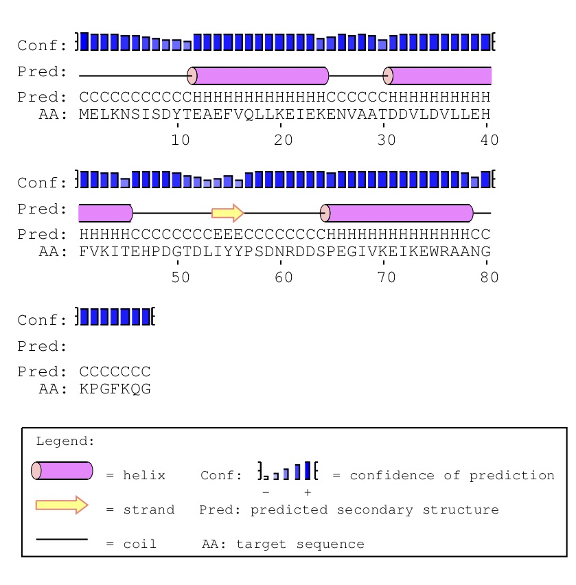

```{r setup, include=FALSE}
library(tint)
# invalidate cache when the package version changes
knitr::opts_chunk$set(tidy = FALSE, cache.extra = packageVersion('tint'))
options(htmltools.dir.version = FALSE)
```

# Ejercicio 2

**1. Elige una proteína (P1) cuya secuencia tenga al menos 80-100 aminoácidos y cuya estructura está depositada en el http://www.rcsb.org/pdb [ http://www.rcsb.org/pdb ].**

Elegimos la proteína **1AYI** (https://www.rcsb.org/structure/1AYI)

**1.1. Descarga el fichero con las coordenadas de P1 en formato PDB, al que llamaremos P1.pdb**
```{bash} 
head "P1.pdb"
```


**1.2 Asigna estructura secundaria (SS) de 3 estados (SS3: H,E,C) a cada residuo de P1 en base los ángulos diedros calculados con el programa 2.2 sobre P1.pdb y el diagrama de Ramachandran. Puedes simplificar las regiones del diagrama como si fueran rectángulos.** 

Utilizamos el programa 2.2 para obtener los ángulos diedros.
```{bash} 
perl "prog22.pl" "P1.pdb" > "1AYI-diedros.txt"
head "1AYI-diedros.txt"
```

Código generado para asignar los 3 estados SS3: H, E, C. 

```{r}
# Pasamos el archivo TXT a TSV
adiedros <- read.delim("1ayi-adiedros.tsv", header = F, 
            sep = "\t", col.names = c("residuos", "amino", "chain", 
                                      "phi", "psi", "omega"),
            colClasses = c("integer", "character", "character", 
                           "numeric", "numeric", "numeric"))

# Definimos las coordenadas para la gráfica de Ramachandran según la página web:
# http://biomodel.uah.es/model1j/prot/Ramachandran.html

phipsi <- c("phi", "psi") 
beta <- matrix(c(-133, 171, -133, 92, -55, 92, -55, 171), 
               nrow = 4, byrow = T, dimnames = list(NULL, phipsi))
alpha1 <- matrix(c(-53, -40, -53, -66, -159, -66, -159, -40), 
                 nrow = 4, byrow = T,  dimnames = list(NULL, phipsi))
alpha2 <- matrix(c(64, 96, 49, 96, 49, 20, 64, 20), 
                 nrow = 4, byrow = T, dimnames = list(NULL, phipsi))

# Función para decidir si un punto p se encuentra dentro de las coordenadas 
# de referencia. Ambos son arreglos con elementos phi y psi. 

isInSquare <- function(p, coordref) {
    return(p[, "phi"] <= max(coordref[, "phi"]) & 
           p[, "phi"] >= min(coordref[, "phi"]) & 
           p[, "psi"] <= max(coordref[, "psi"]) & 
           p[, "psi"] >= min(coordref[, "psi"]))
}

# Función para asignar los tres estados de la estructura secundaria.
# Se usa la función isInSquare definida anteriormente para ubicar el punto.
setHEC <- function(p){
  coordref <- list(beta, alpha1, alpha2)
  asignacion <- sapply(coordref, isInSquare, p = p)
  if(asignacion[1]) {
      return("E") 
  } else if(asignacion[2] | asignacion[3]) {
      return("H")
  } else {
    return("C")
  }
}

#Llamar la función setHEC para cada una de las filas del data frame.
HECs <- lapply(1:nrow(adiedros), function(i){
  asig <- setHEC(adiedros[i, ])
  asig
})

#Concatenar las asignaciones al data frame
asignaciones <- do.call(rbind, HECs)
adiedros[, "asig"] <- asignaciones

#Secuencia SS3
print(paste(asignaciones, collapse = ""))
```

**1.3 Escribe un programa que lea P1.pdb para generar un fichero FASTA P1.faa con la secuencia de aminoácidos contenida en los registros de tipo ATOM.** 

```{r}
# Cambiar código de tres letras al de una letra.
code <- list("Ala"="A", "Cys"="C","Asp"="D", "Glu"="E", "Phe"="F", 
      "Gly"="G","His"="H", "Ile"="I","Lys"="K", "Leu"="L","Met"="M",
      "Asn"="N","Pro"="P", "Gln"="Q","Arg"="R", "Ser"="S","Thr"="T", 
      "Val"="V", "Trp"="W", "Tyr"="Y")
names(code) <- toupper(names(code))

# Leer archivo PDB y seleccionar las filas que inicien con ATOM.
lines <- readLines("P1.pdb")
ids <- grep("^ATOM*", lines)
atom.lines <- lines[ids]

# Separar las líneas por espacios.
atom.lines <- lapply(atom.lines, function(line){
      spl <- strsplit(line, split= " ")[[1]]
      # Eliminar las columnas en blanco.
      spl <- spl[which(spl != "")]
      # Seleccionar las columnas que tienen el aminoácido y su posición.
      return(c(spl[4], spl[6]))
  })
# Unir las filas y convertirlas a data frame.
atom.lines <- as.data.frame(do.call(rbind, atom.lines))
colnames(atom.lines) <- c("amino", "pos")

# Quedarnos con un aminoácido por posición.
atom.lines <- atom.lines[!duplicated(atom.lines$pos), ]

# Convertir a código de una letra.
fasta <- apply(atom.lines, 1, function(al){
  code[al["amino"]][[1]]
})

# Escribir el archivo FASTA.
fasta <- paste(fasta, collapse =  "")
fasta <- paste(">", fasta, sep = "\n")
write(fasta, file = "P1.faa")
```

```{bash} 
cat "P1.faa"
```

**1.4. Haz una búsqueda de secuencias similares a P1 con PSI-BLAST con 3 iteraciones y guarda la matriz de sustitución posición-específica (PSSM) obtenida. **

```{bash, eval=FALSE}
psiblast -num_iterations 3 -out_ascii_pssm P1.pssm -save_pssm_after_last_round 
-num_threads 6 -query P1.faa -db nr
```

```{bash}
head "P1.pssm" 
```

\pagebreak

**1.5. Haz una tabla o diagrama con los primeros 10 residuos de P1.pssm y explica qué significan los valores.**

```{bash}
head -n 13 "P1.pssm" | tail -n +3  > "P1-10.pssm"
head "P1-10.pssm"
```

El archivo PSSM contiene dos matrices. En las filas de cabecera se encuentran los 20 aminoácidos y en la columna cabecera se muestran los residuos numerados de nuestra proteína de interés. Los valores de la primera matriz del lado izquierdo muestra la probabilidad de que cada aminoácido ocurra en diferentes patrones de posiciones en el alineamiento múltiple, mientras que en la matriz del lado derecho muestra que tanto se parecen los valores de las pseudocuentas, es decir los límites de motivos importantes.

```{r message=FALSE, fig.margin = TRUE, fig.width=6, fig.height=5, fig.cap="Matriz de sustitución posición-específica"}
# Programa para visulizar las matrices en forma de heatmap.
library(ComplexHeatmap)

pssm <- read.table("P1.pssm", nrows = 11, header = F, skip = 3)
m1 <- pssm[, 2:22]
rownames(m1) <- paste(rownames(m1), m1[,1], sep = "-")
m1 <- data.matrix(m1[, -1])
colnames(m1) <- c("A", "R", "N", "D", "C", "Q", "E", "G", 
                  "H", "I", "L", "K", "M", "F", "P", "S", 
                  "T", "W", "Y", "V")

ha1 = HeatmapAnnotation(text = anno_text(colnames(m1)))

Heatmap(m1, col = c("tan1", "blue"),
        column_title = "Matriz de sustitución",
        cluster_rows = FALSE, cluster_columns = FALSE, 
        show_heatmap_legend = T,  show_column_names = F, 
        show_row_names = T, bottom_annotation = ha1,
        heatmap_legend_param = list(title = "" ))
```
```{r message=FALSE, fig.margin = TRUE, fig.width=6, fig.height=5, fig.cap="Matriz de comparación entre pseudocuentas"}

m2 <-  pssm[, 23:42]
rownames(m2) <- rownames(m1)
colnames(m2) <- colnames(m1)

Heatmap(m2, col = c("tan1", "blue"),
        column_title = "Matriz de comparación entre pseudocuentas",
        cluster_rows = FALSE, cluster_columns = FALSE, 
        show_heatmap_legend = T,  show_column_names = F, 
        show_row_names = T, bottom_annotation = ha1,
        heatmap_legend_param = list(title = "" ))
```

**1.6. Haz una predicción SS3 para cada residuo de P1 con el predictor PSIPRED y explica muy brevemente cómo funciona.**

```{r out.width = "300px", fig.width=4, fig.fullwidth=TRUE, fig.cap = "Resultados de PSIPRED", fig.height=4, echo=FALSE}

```

PSIPRED realiza análisis a los resultados obtenidos de PSI-Blast mediante la incopraración de técnicas de machine learning y redes neuronales artificiales. 

```{bash}
cat "P1.psipass2.txt"
```

**1.7. Confecciona un alineamiento multi-FASTA para comparar las estructuras secundarias, con un formato similar a este:**
```
>secuenciaP1
MSSMQMDPELAKQLFFEGATVVILNMPKGTEFGIDYNS&hellip;
>SS3_known_phipsi
CCCCCCCCCHHHHHHHHHHHHHCCCCCCCCCCCCCCCC&hellip;
>SS3_predicted
CCCCCCHHHHHHHHHHHHCCCCCCCCCCEEECCCCCCC&hellip;
```

```{bash}
cat "P1_multifasta.faa"
```

**1.8. Escribe un programa que calcule el % de identidad/coincidencia entre las dos SS3 desglosando los 3 estados (hélice [H], lámina[E], coil [C]).**

```{r  fig.margin = TRUE, fig.width=3, fig.height=8, fig.cap="Comparación entre secuencias"}
library(ComplexHeatmap)
# Leer archivo.
lines <- readLines("P1_multifasta.faa")

# Seleccionar las líneas a comparar.
rama <- lines[4]
psiblast <- lines[6]

# Ver que las secuencias tengan el mismo numero de caracteres a comparar.
nchar(rama) == nchar(psiblast)
len <- nchar(rama)
rama <- strsplit(rama, "")[[1]]
psiblast <- strsplit(psiblast, "")[[1]]

# Obtener el porcentaje de identidad en las secuencias según el código de tres estados.
porc.ident <- (sum(rama == psiblast)/len) * 100
Hs <- (sum(psiblast[rama == psiblast] == "H")/len)* 100
Cs <- (sum(psiblast[rama == psiblast] == "C")/len)* 100
Es <- (sum(psiblast[rama == psiblast] == "E")/len)* 100

seq.matrix <- cbind(rama, psiblast)  
annot.text <- c("Ramachandran"," PsiBlast")
ha_rot_cn = HeatmapAnnotation(text = anno_text(annot.text))

Heatmap(seq.matrix, col = c("*"="tan1", "C"="skyblue3", 
                            "E"="violetred1","H" = "springgreen3"), 
       cluster_rows = FALSE, cluster_columns = FALSE, 
       show_heatmap_legend = T, column_title = "Secuencias", 
      column_title_gp = gpar(fontsize = 20, fontface = "bold"),
       top_annotation= ha_rot_cn, show_column_names = F, 
       show_row_names = F, rect_gp = gpar(col= "white"), 
       heatmap_legend_param = list(title = "char", 
                            title_gp = gpar(fontsize=18),
                            labels_gp = gpar(fontsize=12)))

cat("El porcentaje de identidad es:", round(porc.ident, 2), "%.")
cat("Con", round(Hs, 2), "% para Hs", round(Cs, 2), "% para Cs y",
     round(Es, 2), "% para Es")
```
```{r bib, include=FALSE}
# create a bib file for the R packages used in this document
knitr::write_bib(c('base', 'rmarkdown'), file = 'skeleton.bib')
```
