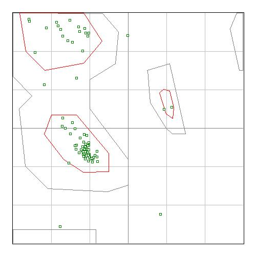

```{r setup, include=FALSE}
library(tint)
# invalidate cache when the package version changes
knitr::opts_chunk$set(tidy = FALSE, cache.extra = packageVersion('tint'))
options(htmltools.dir.version = FALSE)
```

#Ejercicio 3

**El tercer ejercicio consiste en construir y evaluar modelos por homología de la secuencia P1.faa, la proteína que eligieron ayer. Deberán hacerlo por etapas:**


**1. Búsqueda de estructuras de proteínas homólogas: moldes o templates. Para ello son útiles herramientas de fold recognition como HHpred porque tienen una mayor sensibilidad y permiten encontrar similitudes de secuencia significativas muy sutiles, más allá de herramientas como PSI-BLAST.** 
```{bash}
head -n 25 "hhpred_5833734.hhr"
```

\pagebreak

**1.1. Elige 1 ó 2 moldes no redundantes (T1,T2).**

```{bash}
cat "P1_P2_P3.faa"
```
```{bash}
head "5wnw.pdb"
```
```{bash}
head "4qko.pdb"
```

\pagebreak

**1.2. En base a T1-T2 modela la estructura terciaria de P1 desde HHpred, con ayuda de MODELLER. Guarda los ficheros PDB de salida, así como sus anotaciones.**

```{r out.width = "200px", fig.width=4, fig.fullwidth=TRUE, fig.cap = "Resultados de Modeller", fig.height=4, echo=FALSE}

```

```{bash}
head "Modeller_6097201.pdb"
```
```{bash}
head "HHPRED_summary.txt"
```

\pagebreak 

**2. Trata de modelar P1 por predicción de contactos con EVfold (ver sección &ldquo;Modelado de proteínas por predicción de contactos&rdquo;). Guarda los ficheros PDB de salida. [OJO: EVfold puede tardar muchas horas].**

No pudimos obtener los resultados de EVfold porque el job falló en múltiples ocasiones

**3. Evalúa la calidad de los modelos obtenidos:**

**3.1. Graficando su diagrama de Ramachandran.**

```{r out.width = "200px", fig.width=4,fig.fullwidth=TRUE, fig.cap = "Ramachandran plot de 1AYI", fig.height=4, echo=FALSE}

```

```{r out.width = "200px", fig.width=4, fig.fullwidth=TRUE, fig.cap = "Ramachandran plot del modelo obtenido por HHPred", fig.height=4, echo=FALSE}

```

\pagebreak
**3.2. Comparando las estructuras modeladas con la solución experimental P1.pdb. Para ello deben calcular sus superposiciones con MAMMOTH (RMSD y E-valor, instalado en tepeu.lcg.unam.mx) y con TMalign (TMscore, lo tienen que instalar de http://zhanglab.ccmb.med.umich.edu/TM-align/TM-align-C/TMalignc.tar.gz).**

```{bash}
cat "mammoth.txt"
```

```{bash}
cat "TMAlign_result.txt"
```
El alineamiento estructural generado con MAMMOTH muestra que la similitud estructural entre ambos modelos están muy relacionadas (E value < 0.0001). Igualmente el alineamiento mediante TMalign muestra la alta similitud estre ambos modelos (TM-score= 0.87490). 
Se utilizó la página http://tomcat.cs.rhul.ac.uk/home/mxba001/

Observando las gráficas de Ramachandran podemos concluir que el modelo obtenido de la predicción es muy parecido al modelo de nuestra proteína original. La mayoría de los residuos de la proteína se distribuyen de manera similar entre ambos modelos. 


```{r bib, include=FALSE}
# create a bib file for the R packages used in this document
knitr::write_bib(c('base', 'rmarkdown'), file = 'skeleton.bib')
```
