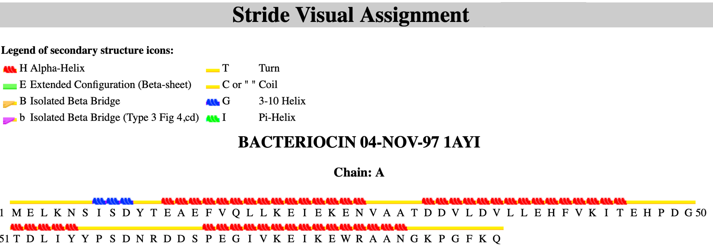
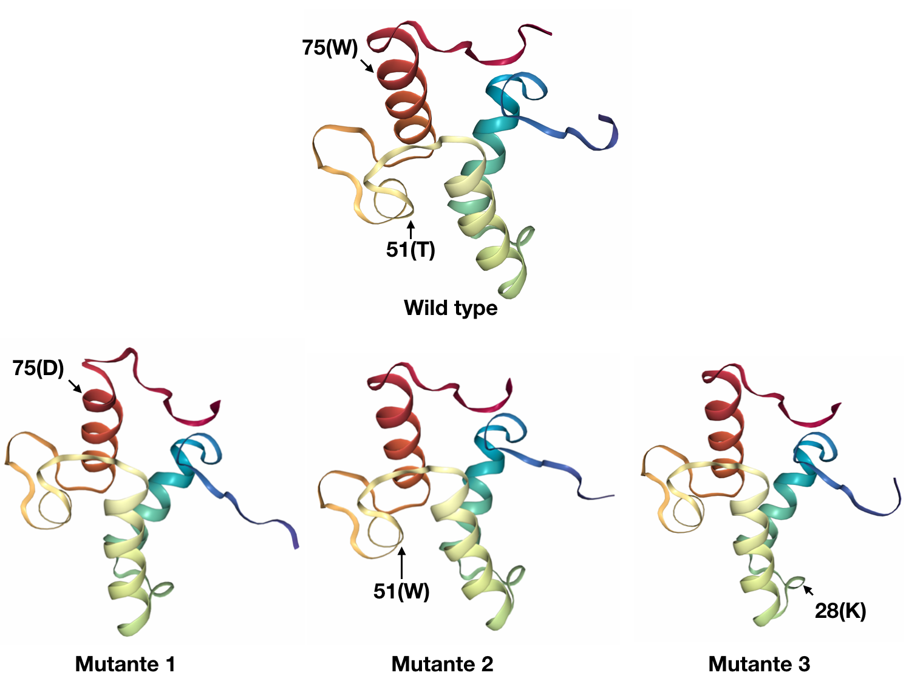
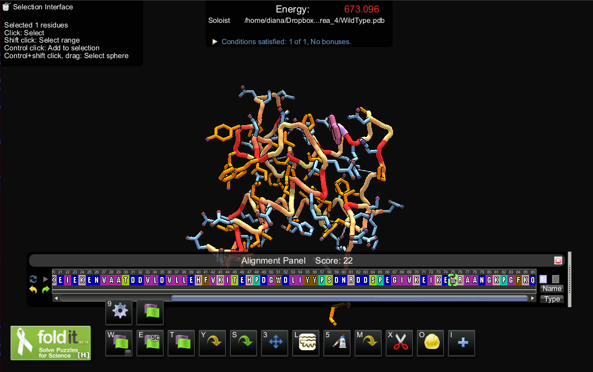
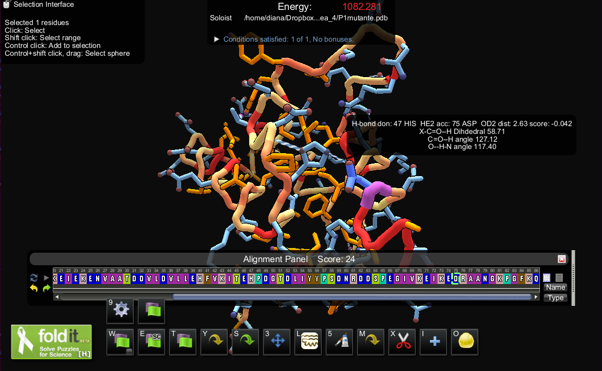
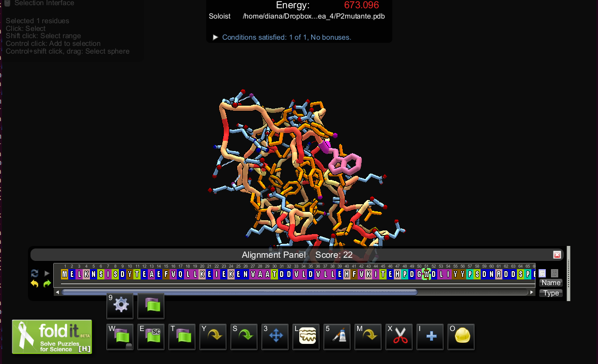
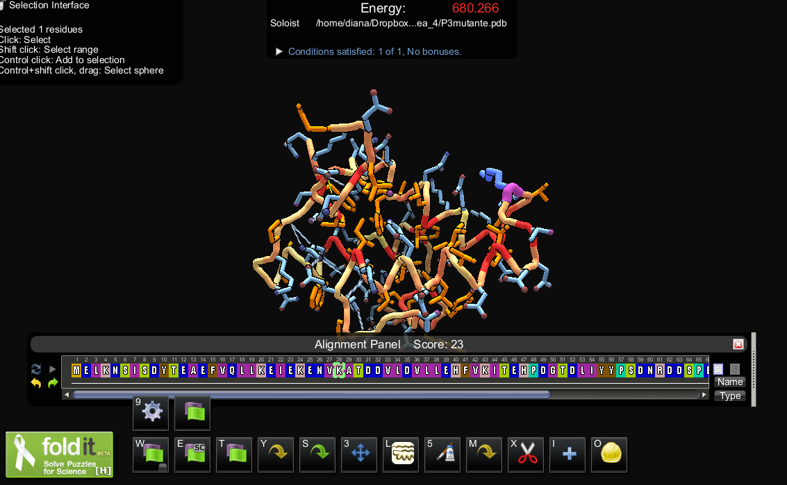

```{r setup, include=FALSE}
library(tint)
# invalidate cache when the package version changes
knitr::opts_chunk$set(tidy = FALSE, cache.extra = packageVersion('tint'))
options(htmltools.dir.version = FALSE)
```

# Ejercicio 4

El último ejercicio consiste en simular 3 variantes de P1 con sustituciones no sinónimas y hacer un prototipo que sirva para evaluar desde el punto de vista estructural sus consecuencias.

**1. Genera P1.1.faa, P1.2.faa y P1.3.faa sustituyendo un aminoácido en la secuencia de P1. Simularemos que cada una de las secuencias resultantes son alelos de P1:**

```
>P1wild-type
MSSMQMDPELAKQLFFEGATVVILNMPKGTEFGIDYNS&hellip;
>P1.1
MSSMQMDPELAKQLFFEGATVVILNMWKGTEFGIDYNS&hellip;
```

```{bash}
cat "P1_mutantes.fasta"
```
**2. Genera una matriz de sustitución posición-específica para P1 con PSIBLAST (3 ciclos) contra la colección de secuencias nr del NCBI (en tepeu) y extrae los pesos evolutivos correspondientes a los 3 mutantes. Comenta los resultados.**

```{bash}
head "P1.pssm"
```

```{r resize.width=100}
pssm <- read.table("P1.pssm", nrows = 86, header = F, 
                   skip = 3)
m1 <- pssm[, 2:22]
rownames(m1) <- paste(rownames(m1), m1[,1], sep = "-")
m1 <- data.matrix(m1[, -1])
colnames(m1) <- c("A", "R", "N", "D", "C", "Q", "E", "G",
                  "H", "I", "L", "K", "M", "F", "P", "S", 
                  "T", "W", "Y", "V")

## Mutante 1
cat("Mutante 1:",  m1[75, 4], "W -> D")
cat("Mutante 2:",  m1[51, 18], "T -> W")
cat("Mutante 3:",  m1[28, 12], "A -> K")
```

Elegimos la sustitución con el valor más pequeño en la matriz de sustituciones para P1, para P2 elegimos un valor en 0 y para P3, decidimos cambiar una Alanina (residuo no polar) por una Lisina (residuo cargado positivamente), que también tiene un valor de 0 en la matriz de sustitución.


\pagebreak

**3. Haz la asignación de estructura secundaria de P1 con STRIDE y de acuerdo con la Figura 5.15 comenta el efecto esperado de las mutaciones.**

```{r out.width = "500px", echo=FALSE,  fig.fullwidth=TRUE, fig.width=3, fig.height=3, fig.cap = "Visual output en STRIDE"}

```

Para la primer mutante P1.1.faa sustituímos el residuo 75 (W->D) que de acuerdo a la estructura secundaria W se encuentra en los últimos giros de la hélice-alfa, por lo que  sustitución de W a D aumentaría la inestabilidad es esa sección. Además disminuiría la estabilidad del giro Phi negativo que posee el residuo original.

En la segunda mutante P1.2.faa sustiruímos el residuo 51 (T->W). Según la figuira 5.15 esta sustitución probablemente aumente no tan significativamente la estabilidad de la  hélice-alfa predicha en esa posición. 

En la tercer mutante P1.3.faa sustituímos el residuo 28 (A->K). Los residuos de A prcipalmente se encuentran en los núcleos hidrofóbicos, donde Rocklin G y cols. observaron que se originan la mayoría de mutaciones sensibles a la degradación por proteasas. Nuestra mutación inducida probablemente desestabilice la estructura exponiendose a la superficie dicho residuo.

\pagebreak

**4. Construye modelos por homología para los 3 mutantes.**

**4.1 Visualiza los mutantes y wt en FoldIt y evalúa si hay diferencias en cuanto a empaquetamiento y puentes de hidrógeno. Guarda algunas figuras como evidencia.**

```{r out.width = "400px", fig.width=4, fig.height=4, fig.fullwidth=TRUE, fig.cap = "Visualización de la proteína wild type y los tres mutantes en Modeller", echo=FALSE}

```

La sustitución inducida en el primer mutante forma un puente de hidrógeno con el residuo 45(Thr) que no se forma en la proteína silvestre. Dicho puente de hidrógeno aparentemente no afecta el empaquetamiento de la proteína pero sí la conformación de la última vuelta de la hélice álfa cerca del extremo carboxilo. 
No apreciamos diferencias en cuanto a formación de puentes de hidrógeno o empaquetamiento entre los mutante 2 y 3 en comparación de la proteína silvestre. 

```{r out.width = "400px", fig.width=4, fig.fullwidth=TRUE, fig.cap = "P1 Wild type", fig.height=4, echo=FALSE}

```
```{r out.width = "400px", fig.width=4, fig.fullwidth=TRUE, fig.cap = "P1 mutante 1", fig.height=4, echo=FALSE}

```
```{r  out.width = "400px", fig.width=4, fig.fullwidth=TRUE, fig.cap = "P1 mutante 2", fig.height=4,  echo=FALSE}

```
```{r out.width = "400px", fig.width=4, fig.fullwidth=TRUE, fig.cap = "P1 mutante 3", fig.height=4, echo=FALSE}

```

\pagebreak

**4.2 Calcula para cada mutante y para wt el número de contactos con residuos vecinos en un radio de 15Angstrom sin contar hidrógenos. Para poder poner estos contactos en contexto calcular la distribución de contactos de todos los residuos. Comenta los resultados.**


```{python fig.margin = TRUE, fig.width=4, fig.height=4, fig.cap = "Distancias entre residuos"}
import Bio.PDB
import numpy as np
import pylab as plt
import seaborn as sns

pdb_code = "1AYI"
pdb_filename = "P1.pdb"

# Código adaptado de
# https://warwick.ac.uk/fac/sci/moac/people/students/peter_cock/python/protein_contact_map/

## Función para calcular la distancia entre residuos
def calc_residue_dist(residue_one, residue_two) :
    min_dist =  10000.0
    ## Tomar la distancia mínima entre los átomos de los dos residuos
    for atom1 in residue_one.get_atoms():
        for atom2 in residue_two.get_atoms():
            diff_vector = atom1.coord - atom2.coord
            adist = np.sqrt(np.sum(diff_vector * diff_vector))
            if adist < min_dist:
                min_dist = adist
    return min_dist

## Función que regresa una matriz con las distancias entre dos residuos
def calc_dist_matrix(chain_one, chain_two, dim) :
    answer = np.zeros((dim, dim), np.float)
    for row, residue_one in enumerate(chain_one) :
        if residue_one.get_resname() != "HOH":
            for col, residue_two in enumerate(chain_two) :
                if residue_two.get_resname() != "HOH":
                    answer[row, col] = calc_residue_dist(residue_one, residue_two)
    return answer

structure = Bio.PDB.PDBParser().get_structure(pdb_code, pdb_filename)
model = structure[0]
#La proteína solo tiene una cadena
dist_matrix = calc_dist_matrix(model["A"], model["A"], 86)
## Distribución de las distancias
plt.figure()
A = np.asarray(dist_matrix).reshape(-1)
sns_plot = sns.distplot(A, hist=True)
plt.title("Distribucion de distancias", y=1.01)
plt.show()

## Heatmap de distancias
plt.figure()
plt.matshow(np.transpose(dist_matrix))
plt.colorbar()
plt.gca().xaxis.tick_bottom()
plt.title("Heatmap de distancias", y=1.01)
plt.show()
## Distancias menores a 15 Angstroms

plt.figure()
contact_map = dist_matrix < 15.0
plt.title("Distancias menores a 15 Angstroms", y=1.01)
plt.imshow(np.transpose(contact_map))
plt.show()
```
La media de las distancias entre residuos se encuentra alrededor de los 15 Angstroms, aunque hay una cantidad considerable de residuos separados por una distancia de alrededor de los 4 Angstroms. Creemos que el patrón observado en los residuos más cercanos se debe a las tres estructuras de Alpha hélice que componen la proteína.

```{r bib, include=FALSE}
# create a bib file for the R packages used in this document
knitr::write_bib(c('base', 'rmarkdown'), file = 'skeleton.bib')
```